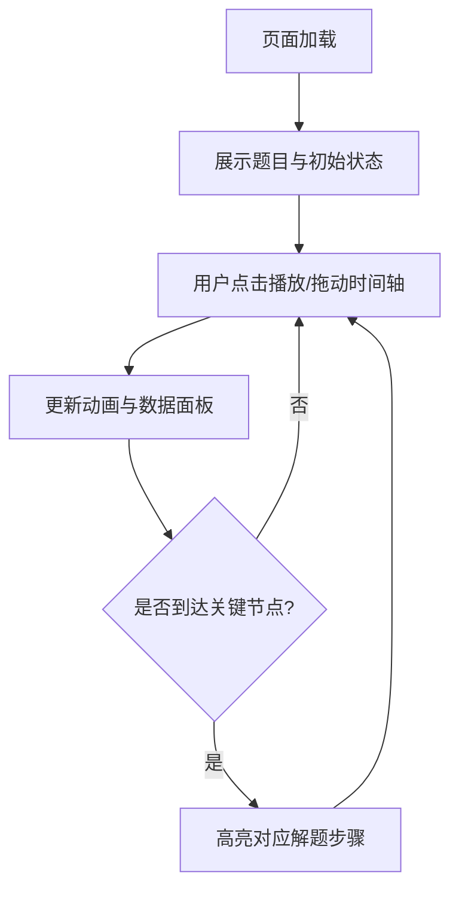

# 船行问题解题助手 - 产品需求文档

## 1. 产品概述
一个面向中学生的交互式物理学习工具，通过动态可视化帮助理解船行相遇问题。将抽象的相对运动概念转化为直观的动画演示，让学生能够分步骤理解解题思路。

## 2. 核心功能

### 2.1 功能模块
1. **题目展示区**: 清晰展示原题内容，关键数据高亮显示
2. **动态演示区**: 可视化河道、两船运动轨迹、实时位置变化
3. **分步解析区**: 按时间线展示解题步骤，支持逐步展开
4. **参数控制区**: 可调节时间轴，观察任意时刻两船状态
5. **公式展示区**: 动态展示速度计算、相遇方程等关键公式

### 2.2 页面详情

| 模块名称 | 功能描述 |
|---------|---------|
| 题目卡片 | 展示完整题目，水流速度、船速等关键数字用不同颜色标注 |
| 动画画布 | 横向河道场景，甲船(红色)、乙船(蓝色)实时运动，支持播放/暂停/重置 |
| 时间轴控制 | 滑块控制时间，可精确到0.1小时，显示当前时刻两船位置和距离 |
| 解题步骤面板 | 4个步骤卡片：①初始运动 ②调头时刻 ③相向运动 ④相遇时刻 |
| 数据面板 | 实时显示速度、位置、距离等计算数据 |
| 公式推导区 | 展示速度计算、相遇方程的推导过程 |

## 3. 核心流程

## 4. 用户界面设计

### 4.1 设计风格
- **整体风格**: 清新教育风，类似课堂白板
- **主色调**: 浅蓝色(#E3F2FD)背景，深蓝色(#1565C0)强调
- **辅助色**: 红色(#E53935)代表甲船，蓝色(#1E88E5)代表乙船
- **字体**: 标题用圆润字体，正文用清晰易读的无衬线字体
- **布局**: 左侧动画区占60%，右侧信息面板占40%

### 4.2 动画效果
- 船只用简洁的三角形图标，带方向指示
- 水面用淡蓝色渐变，添加 subtle 波纹动画
- 运动轨迹用虚线表示，已走过的路径加深显示
- 关键时间点(9:00调头、相遇时刻)添加脉冲高亮效果

### 4.3 交互设计
- 时间轴滑块可精确控制，步进0.1小时
- 鼠标悬停数据点显示详细计算过程
- 解题步骤卡片点击可展开详细推导
- 提供"自动播放"按钮，按时间顺序演示完整过程

### 4.4 响应式设计
- 桌面端：左右分栏布局
- 平板/手机：上下堆叠布局，动画区占屏幕上半部分
