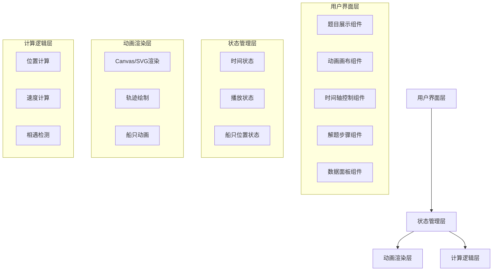

# 船行问题解题助手 - 技术架构文档

## 1. 架构设计



## 2. 技术选型

- **前端框架**: React 18 + TypeScript
- **构建工具**: Vite
- **样式方案**: Tailwind CSS
- **动画库**: Framer Motion (用于UI动画)
- **图标**: Lucide React

## 3. 组件结构

| 组件名 | 职责 |
|-------|------|
| App | 主容器，整合所有子组件 |
| ProblemCard | 题目展示，高亮关键数据 |
| RiverCanvas | 动画画布，渲染河道和船只 |
| TimelineControl | 时间轴滑块和播放控制 |
| SolutionSteps | 分步解题卡片 |
| DataPanel | 实时数据显示 |
| FormulaDisplay | 公式推导展示 |

## 4. 核心算法

### 4.1 位置计算
```typescript
// 根据时间t计算两船位置
type ShipPosition = {
  x: number;  // 距离O点的距离(km)
  direction: 'east' | 'west';
}

function calculatePositions(t: number): [ShipPosition, ShipPosition] {
  // t: 从8:00开始经过的小时数
  // 甲船: 0-1小时向东，1小时后向西
  // 乙船: 始终向东
}
```

### 4.2 关键时间点
- t=0: 8:00，两船从O点出发
- t=1: 9:00，甲船调头
- t=1.2: 相遇时刻

## 5. 数据结构

```typescript
interface ProblemData {
  waterSpeed: number;      // 水流速度 2km/h
  shipA_Speed: number;     // 甲船静水速度 18km/h
  shipB_Speed: number;     // 乙船静水速度 12km/h
  startTime: string;       // "8:00"
  turnTime: string;        // "9:00"
}

interface ShipState {
  id: 'A' | 'B';
  position: number;        // 距离O点的距离
  velocity: number;        // 当前速度(带方向)
  direction: 'east' | 'west';
}

interface TimelineState {
  currentTime: number;     // 当前时间(小时，从8:00开始)
  isPlaying: boolean;
  duration: number;        // 总演示时长 1.5小时
}
```

## 6. 动画参数

- **画布尺寸**: 800x300px (桌面)，响应式适配
- **坐标比例**: 1km = 20px
- **播放速度**: 1秒 = 0.1小时 (可调整)
- **帧率**: 60fps
